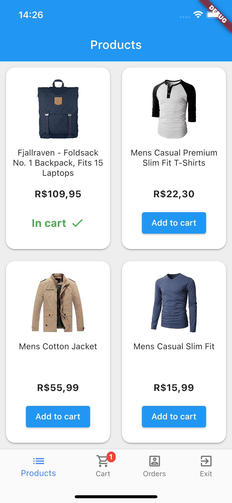
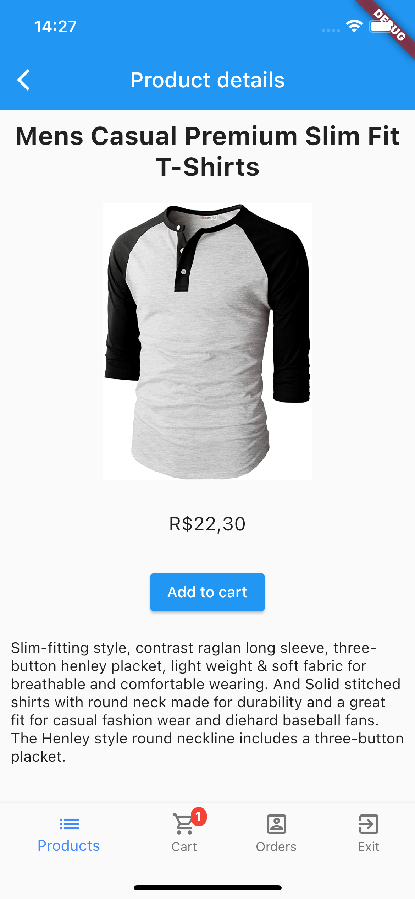
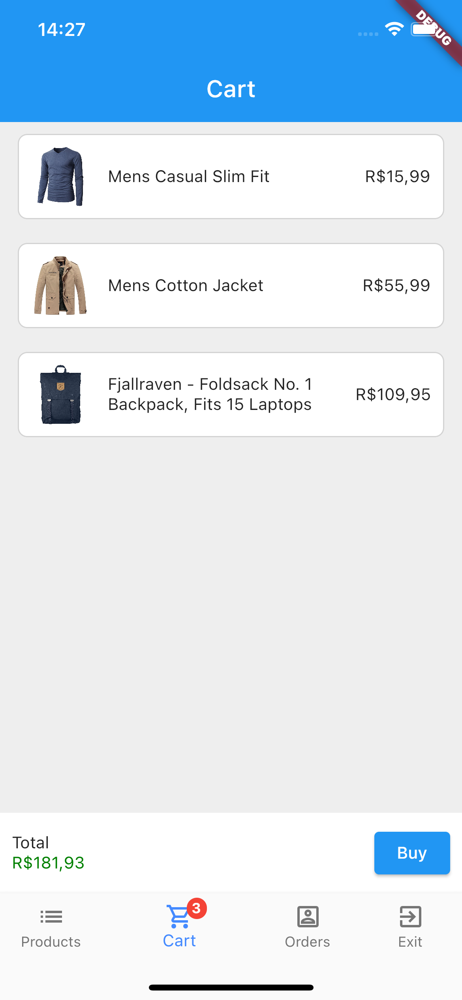
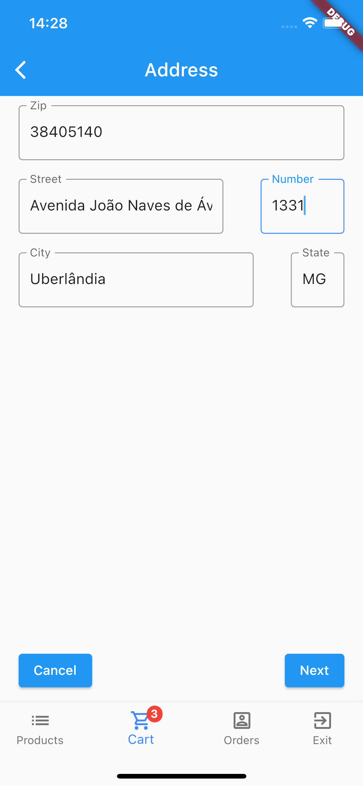
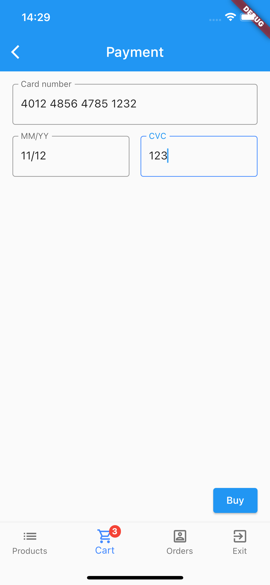
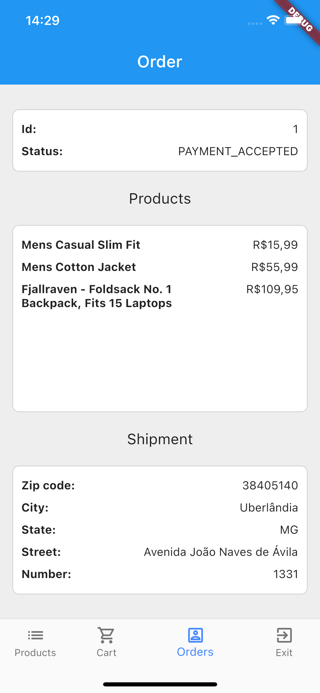

# Sample

## Contents
1. [Introduction](#introduction)
1. [Screens](#screens)
1. [Keep reading](#keep-reading)

## Introduction
To showcase this lib, we developed small application that uses it for developing a Flutter app with server-driven
screens. The backend part of this app is in this repository at `/sample`. The frontend part of the app is
[here](https://github.com/Tiagoperes/beagle-store-sample).

The sample is an online store app with a bottom navigation bar and 6 server-driven screens.

## Screens

### Products
This screen lists all the products in the store. By clicking a product image you go to the details of it, by clicking
in "Add to cart", it adds the product to the shopping cart.

When a product is added to the cart, a counter notification at the top of the menu item "cart" changes its value, this
has been done with the custom action "updateCartIndicator". For formatting the price we used a custom operation named
"formatPrice". When the list of products is loading, we used a custom component named "Spinner" to show an animation,
while each product in the list has been rendered using another custom component called "Product".

Instead of using a [Context](/context) we could also have loaded the products in the backend and sent them as the value
of the property `dataSource` in the ListView. We used the Context to showcase this feature. In real applications, any of
these strategies can be used.

### Product details
Shows the details of a product, it receives the product as an item in the navigation context.

Although we used the Navigation Context, other strategies, like passing the product id in the URL would also be valid.

### Shopping cart
Shows every product in the shopping cart. The shopping cart is part of the Global Context, i.e. it can be accessed and
modified from anywhere in the application. By clicking the button "Buy", the user is redirected to the screen for
filling an address.

In the bottom of the screen we show the total price, which has been done via a custom operation called "sumProducts".

### Address
A form for submitting an address. The interesting part here is that when the zip-code is filled, a request is made
to a zip-code API and the rest of the address is auto-filled by the response.

By clicking "Next", the address is passed via the navigation context to the next part of the form: payment.

### Payment
Very similar to the address form. It completes the form and submits its data in a POST request to the backend. When
the request succeeds, it redirects the user to the order details.

### Order
Shows the details of the order. It receives the orderId as a route parameter, and load it with a `sendRequest` action.
As said before, this could have used another strategy, but we wanted to showcase here the use of route parameters and
the Beagle Context.

## Keep reading
**Next topic: [Using the Beagle Backend Typescript without Express](/without-expressions)**
